# Specialized Support Vector Machines (SSVM)

In this repository, we provide the results obtained from the experiments accomplished in the paper entitled "Specialized Support Vector Machines for Open-set Recognition".
To replicate the results, it is required to have [R](https://cran.r-project.org/) and [GNU make](https://www.gnu.org/software/make/) installed.
If requirements are satisfied, just type `make` from the command line to perform statistical tests.

## Raw data

Files in [normal](statcsv_ossvm_R1_normal/), [ocbb](statcsv_ossvm_R1_normal_ocbb/), [onlyImageNet](statcsv_ossvm_R1_onlyImageNet/), and [unbalanced](statcsv_ossvm_R1_unbalanced_open/) directories contain the raw data.
[CSV](https://en.wikipedia.org/wiki/Comma-separated_values) files are named `stat___<measure>.csv`, in which `<measure>` can be one of the following.
- `na` Normalized accuracy (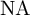)
- `harmonicNA` Harmonic normalized accuracy (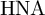)
- `mafm` Macro-averaging open-set f-measure (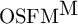)
- `mifm` Micro-averaging open-set f-measure (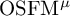)
- `bbmafm` Multiclass macro-averaging f-measure (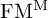)
- `bbmifm` Multiclass micro-averaging f-measure (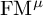)

Evaluated methods include:
- `svm` 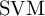
- `dbc` 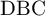
- `1vs` 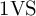
- `mcocsvm` 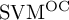
- `mcocbbsvm` 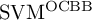
- `mcocbbsvmovo` 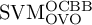
- `mcsvdd` 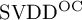
- `mcsvddbb` 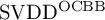
- `mcsvddbbovo` 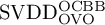
- `wsvm` 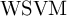
- `pisvm` 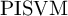
- `ssvm` 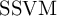
