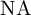
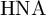
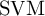
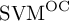
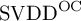
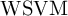
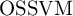
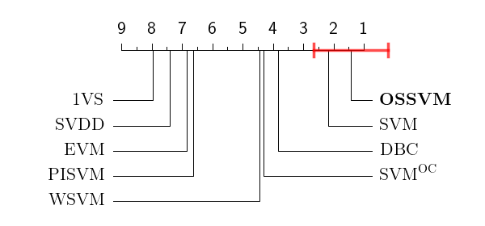
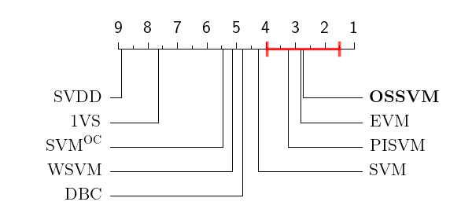
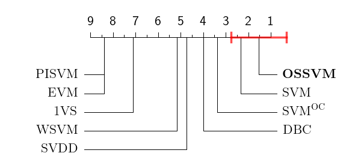

<!-- -*- eval: (git-gutter-mode); -*- -->
# Specialized Support Vector Machines (SSVM) — Results

In this repository, we provide the raw results obtained from the experiments accomplished in the paper entitled "Specialized Support Vector Machines for Open-set Recognition".
We also provide the scripts we have employed for performing the statistical tests and generating diagrams and tables present in the paper.
For generating those diagrams and tables, it is required to have [Python 2](https://www.python.org/), [R](https://cran.r-project.org/) and [GNU make](https://www.gnu.org/software/make/) installed.

## Raw data

Raw results are available in [CSV_files](CSV_files/) directory following the [CSV](https://en.wikipedia.org/wiki/Comma-separated_values) format.  Each evaluation measure has its corresponding CSV file.  Those CSV files contain the following fields:

Field | Description
-|-
`lenacs` | Number of available classes for training
`dataset` | Name of the dataset
`classifier` | Name of the classifier
`experiment` | A number in the range 1–10 specifying one of the 10 experiments per combination of number of available classes, dataset, and classifier
`result` | Specifying the result for the respective measure indicated in the filename

The evaluation measures employed are the following:

Repr. | Description | Acronym
-|-|-
`NA` | Normalized Accuracy | 
`HNA` | Harmonic Normalized Accuracy | 
`OSFMM` | Macro-Averaging Open-Set F-Measure | 
`OSFMm` | Micro-Averaging Open-Set F-Measure | 
`FMM` | Multiclass Macro-Averaging F-Measure | 
`FMm` | Multiclass Micro-Averaging F-Measure | 

Evaluated methods include:

Repr. | Description | Acronym | Reference
-|-|-|-
`svm` | Support Vector Machines |  | Chih-Chung Chang and Chih-Jen Lin. [LIBSVM: A library for Support Vector Machines](https://doi.org/10.1145/1961189.1961199). _**ACM Transactions on Intelligent Systems and Technology**_, 2(3):27:1–27:27, April 2011.
`ocsvm` | One-class SVM |  | Dimitrios A. Pritsos and Efstathios Stamatatos. [Open-set classification for automated genre identification](https://doi.org/10.1007/978-3-642-36973-5_18). In _**European Conference on Information Retrieval**_, volume 7814 of Lecture Notes in Computer Science, pages 207–217, Moscow, Russia, March 2013. Springer, Berlin, Heidelberg.
`svdd` | Support Vector Data Description |  | David M. J. Tax and Robert P. W. Duin. [Support vector data description](https://doi.org/10.1023/B:MACH.0000008084.60811.49). _**Springer Machine Learning**_, 54(1):45–66, January 2004.
`dbc` | SVM Decision Boundary Carving |  | Filipe de Oliveira Costa, Ewerton Silva, Michael Eckmann, Walter J. Scheirer, and Anderson Rocha. [Open set source camera attribution and device linking](https://doi.org/10.1016/j.patrec.2013.09.006). _**Elsevier Pattern Recognition Letters**_, 39:92–101, April 2014.
`onevset` | 1-vs-Set Machine |  | Walter J. Scheirer, Anderson de Rezende Rocha, Archana Sapkota, and Terrance E. Boult. [Towards open set recognition](https://doi.org/10.1109/TPAMI.2012.256). _**IEEE Transactions on Pattern Analysis and Machine Intelligence**_, 35(7):1757–1772, July 2013.
`wsvm` | Weibull-calibrated SVM |  | Walter J. Scheirer, Lalit P. Jain, and Terrance E. Boult. [Probability models for open set recognition](https://doi.org/10.1109/TPAMI.2014.2321392). _**IEEE Transactions on Pattern Analysis and Machine Intelligence**_, 36(11):2317–2324, November 2014.
`pisvm` | SVM with Probability of Inclusion |  | Lalit P. Jain, Walter J. Scheirer, and Terrance E. Boult. [Multi-class open set recognition using probability of inclusion](https://doi.org/10.1007/978-3-319-10578-9_26). In _**European Conference on Computer Vision**_, volume 8691, part III of Lecture Notes in Computer Science, pages 393–409, September 2014.
`evm` | Extreme Value Machine |  | Ethan M. Rudd, Lalit P. Jain, Walter J. Scheirer, and Terrance E. Boult. [The Extreme Value Machine](https://doi.org/10.1109/TPAMI.2017.2707495). _**IEEE Transactions on Pattern Analysis and Machine Intelligence**_, 40(3):762–768, March 2018.
`ssvm` | Specialized SVM |  | **Proposed method**

The suffix `O` or `C` in the representation name of each of those classifiers indicate if it was trained by performing open- or closed-set grid search approach, respectively.

## Generating Critical Difference’s diagrams

For generating the Critical Difference (CD) diagrams, Python 2 is required.
The required packages are specified in [requirements.txt](requirements.txt).
For installation of the required packages, run:

```shell
> pip install -r requirements.txt
```


For generating the CD diagrams, run:

```shell
> make plot_CD
```


It will generate the CD diagrams inside the `CD_diagrams/` directory.

The main script responsible for generating the diagrams is [plot_CD.py](plot_CD.py).

Generated diagrams are shown in [Critical Difference’s diagrams](#critical-differences-diagrams) below.

## Generating open- versus closed-set results

For generating Wilcoxon and Binomial statistical tests for comparison of open- and closed-set grid search strategies, R is required as well as its packages `dplyr` and `tidyr`.
For generating a PDF table (optional), `pdflatex` is required.
For obtaining the _p_-values, run:

```shell
> make GS_comparison
```


Results will be in `*.tex` files in `tables_openvsclosed/` directory.

The script responsible for generating the statistical comparison is [openvsclosed.R](openvsclosed.R).

Generated results are depicted in [Open- and closed-set grid search comparison](#open--and-closed-set-grid-search-comparison) below.

## Critical Difference’s diagrams

Here we show the CD diagrams generated following the instructions in [Generating Critical Difference’s diagrams](#generating-critical-differences-diagrams).

**Note:** In our paper, we have included only the CD diagrams referring to the column “**Open-set grid search**” herein.

<table>
	<tr><th>Open-set grid search</th><th>Closed-set grid search</th></tr>
	<!-- NA -->
	<tr><td align="middle" colspan="2"><b>Normalized Accuracy — </b></td></tr>
	<tr><td></td><td></td></tr>
	<!-- HNA -->
	<tr><td align="middle" colspan="2"><b>Harmonic Normalized Accuracy — </b></td></tr>
	<tr><td></td><td></td></tr>
	<!-- OSFMM -->
	<tr><td align="middle" colspan="2"><b>Macro-averaging Open-Set F-Measure — </b></td></tr>
	<tr><td></td><td></td></tr>
	<!-- OSFMm -->
	<tr><td align="middle" colspan="2"><b>Micro-averaging Open-Set F-Measure — </b></td></tr>
	<tr><td></td><td></td></tr>
	<!-- FMM -->
	<tr><td align="middle" colspan="2"><b>Multiclass Macro-averaging F-Measure — </b></td></tr>
	<tr><td></td><td></td></tr>
	<!-- FMm -->
	<tr><td align="middle" colspan="2"><b>Multiclass Micro-averaging F-Measure — </b></td></tr>
	<tr><td></td><td></td></tr>
</table>

## Open- and closed-set grid search comparison

In the following images we present raw _p_-values obtained with Wilcoxon and Binomial statistical tests.
Those are the _p_-values generated following the instructions in [Generating open- versus closed-set results](#generating-open--versus-closed-set-results).
In those images:
- **Bold** means there is statistical difference with 95% of confidence.
- The **\*** indicates the statistical difference is with 99% of confidence.
- And **<.0001\*** indicates the statistical difference is with 99.99% of confidence.
- **Emphasized in red** means the version with closed-set grid search obtains better performance for measure associated with that row.


_**Wilcoxon** statistical tests for the pairwise comparison between open- and closed-set grid search implementation for every method and every measure._


_**Binomial** statistical tests for the pairwise comparison between open- and closed-set grid search implementation for every method and every measure._
